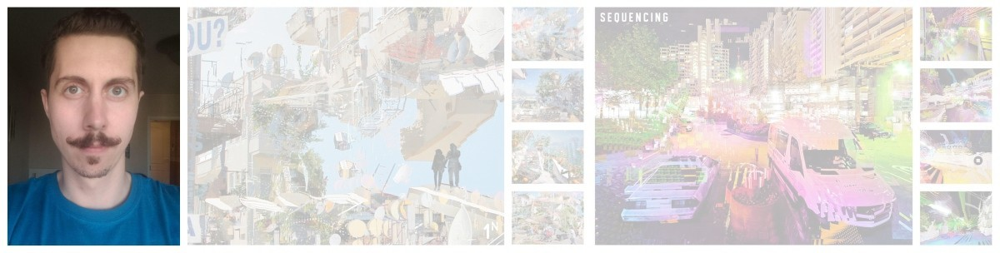
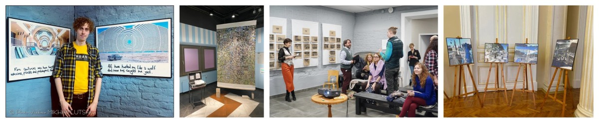
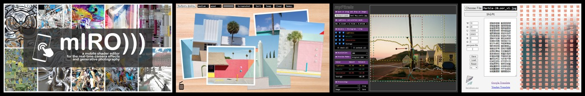

### Сергей Егоров
1989 г.р., Санкт-Петербург
цифровой художник, web-разработчик

Обожаю программирование графики и шейдеры, люблю фото-фильтры, генеративный арт, анализ изображений. Ищу работу на длительный срок, готов к неоплачиваемой стажировке.

## Творческая деятельность

Автор нескольких десятков персональных проектов в области цифровой фотографии и арта, работаю совместно с художниками и писателями, участвую в выставках, выступаю на тематических встречах и артист-толках, пишу статьи и переводы.

### Портфолио
- [Карта проектов](https://drive.google.com/file/d/1PH5zUCI5fG4gaNfyMc-qJ1GlCYsdxxsD/view?usp=sharing)
- [Behance](https://www.behance.net/hayabuzo)

### Участие в выставках
- 2019 — «Цифровой урбанизм» (галерея «Зерно», СПб).
- 2019 — «Осень» (Союз художников России, СПб).
- 2021 — «ФотоТоп» (галерея Классической Фотографии, Москва).
- 2022 — «Расплавленная реальность» (galleryF11.com).
- 2022 — «Новый взгляд на Петербург» (Мариинский дворец, СПб).
- 2022 — «Там, где ты» (Никольские ряды, СПб).
- 2023 — «Программируемое искусство» (галерея Краснохолмская, Москва).

### Публикации
- 2019 — «Оптические эффекты в цифровой фотографии» (журнал «fotoсфера», СПб).

### Тексты
- 2018 — «Вокруг алфавита на нейромашине» / [link](https://vk.com/@hayabuzo-across-the-alphabet)
- 2018 — «Оптические эффекты в цифровой фотографии» / [link](https://vk.com/@hayabuzo-lens-intervention)
- 2018 — «Цифровые инструменты 90-х для разрушающей обработки снимков» / [link](https://vk.com/@hayabuzo-digital-filters)
- 2019 — «Визуализация спектров Фурье с помощью Python» / [link](https://vk.com/@hayabuzo-fourier-spectrum)
- 2022 — «Генеративная фотография» / [link](https://vk.com/@hayabuzo-generative-photography)

## Программирование

Создаю браузерные приложения для работы с графикой и реалтайм-эффектами камеры. Опыта коммерческой разработки пока нет, но очень хочу его получить. 

### Портфолио

- [GitHub](https://github.com/hayabuzo/)
- [OpenProcessing](https://openprocessing.org/user/223853)
- [ShaderToy](https://www.shadertoy.com/user/hayabuzo)

### Основные проекты

**mIRO)))** — приложение для генеративной фотосъемки со встроенным редактором шейдеров, библиотекой графических функций и визуальных эффектов. [app](https://hayabuzo.github.io/mIRO/) / [repo](https://github.com/hayabuzo/mIRO)-  [article](https://www.behance.net/gallery/152769473/Generative-Photography)

**myTable** — приложение для просмотра, отбора и сортировки изображений, имитирует работу с напечатанными фотоснимками, разложенными на столе. [app](https://hayabuzo.github.io/myTable/) / [repo](https://github.com/hayabuzo/myTable) / [video](https://www.youtube.com/watch?v=z9mCGHdq55A)

**myPixels** — приложение для анализа изображений, вычисляет композиционное равновесие по расположению пятен света, деталей и цветовой насыщенности, а также предлагает варианты кадрирования. [app](https://hayabuzo.github.io/myPixels/) / [repo](https://github.com/hayabuzo/myPixels)

**cloudy.room** — приложение для анимации изображений через эффекты глубины, динамического освещения и движения камеры. [app](https://hayabuzo.me/tools/cloud/) / [repo](https://github.com/hayabuzo/cloudy.room)

**echo.gt** — приложение для генерации названий и фраз, основанных на преобразовании координат и цветов пикселей в иероглифы. [app](https://hayabuzo.github.io/echo.gt/) / [repo](https://github.com/hayabuzo/echo.gt) / [video](https://www.youtube.com/watch?v=7TDf6wg8CHE)

### Инструменты

- Использую в работе: **JavaScript, p5.js, WebGL**.
- Интересуюсь и изучаю: **Node.js, Three.js, React.js**.

## Краткая биография

По образованию морской инженер, работал в судостроении и энергетике. В должности сервисного инженера обслуживал дизельные электроустановки в море и на нефтяных станциях. В должности инженера по планированию занимался учетом трудовых ресурсов, автоматизировал рабочие процессы. Проходил обучение и стажировки в Финляндии, Германии, Италии.

Уровень английского: **B2**.
Ключевые навыки: **исполнительность, грамотность, пунктуальность, творческое мышление**.

Интересуюсь теорией фотографии, генеративным искусством, электронной музыкой, поэзией, христианством. Женат, есть ребенок. Живу в Санкт-Петербурге, готов к переезду.
